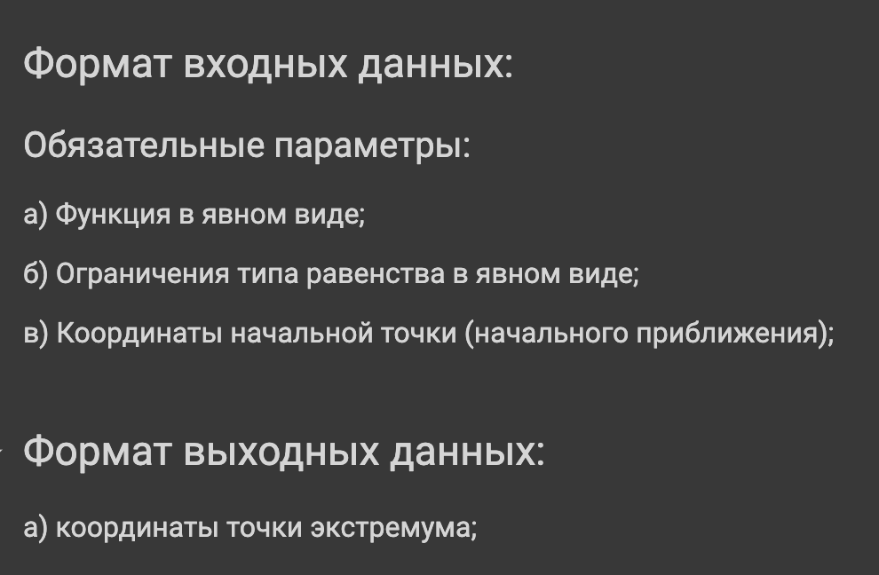
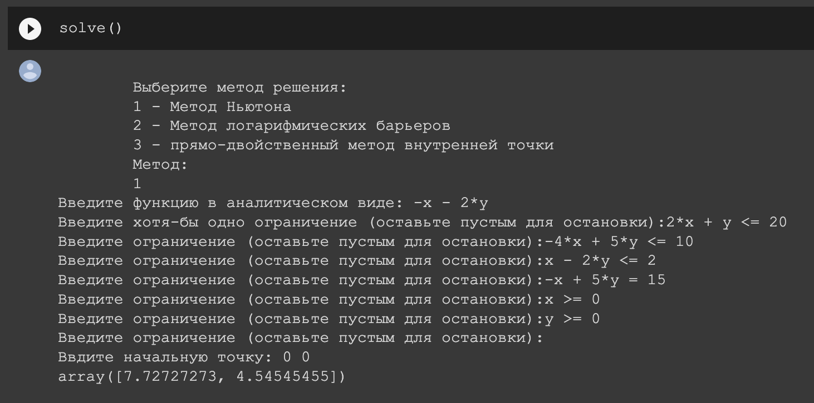
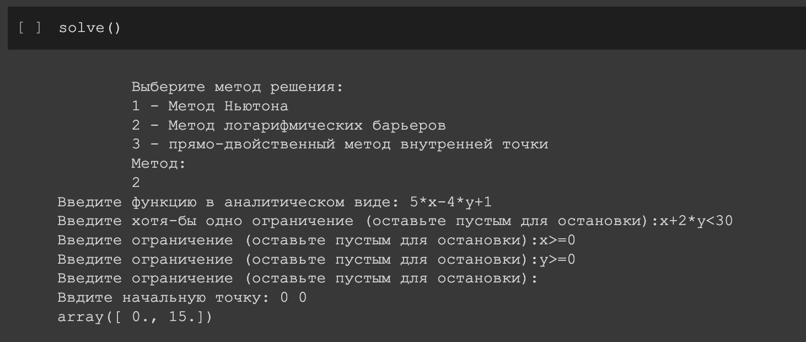
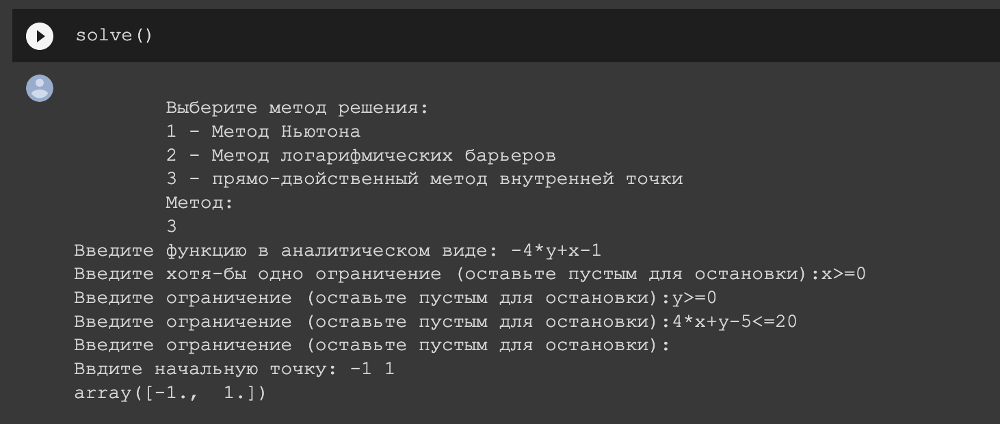

<html>
	<body>
		<h2>Оптимизационные задачи в машинном обучении.   Проект № 5: Метод внутренней точки.</h2>
		

		<h3>Документация</h3>
		<h4>Всю документацию о проекте вы можете найти <a href = "documentation.pdf">здесь</a></h4>
		

		<h3>Jira</h3>
		<h4>Наша <a href = "https://opml.atlassian.net/jira/software/projects/KE5/boards/4">Аgile-доска</a> в <a href = "https://www.atlassian.com/ru/software/jira">Jira</a></h4>
		

		<h3>Решение задач</h3>
		<h4>Решить свою задачу можно в  </h4>
		

		<h3>Примеры решения задач</h3>
		<h5>Формат входных и выходных данных: </h5> 
		
		<h5>Решение методом Ньютона: </h5>                                                
		
		<h5>Решение методом Логарифмических барьеров: </h5>                                                
		
		<h5>Решение прямо-двойственным методом внутренней точки: </h5>                                                
		
		

		<h3>Участники проекта</h3>
		<h4>
		<li>Белоцерковский Даниил - Менеджер проектa</li>
		<li>Хасыков Бата - Программист</li>
		<li>Пучков Александр - Аналитик</li>
		<li>Поплевин Роман - Аналитик, Тестировщик</li>
		<li>Бады Денис - Тестировщик</li>
		 
		Группа ПМ19-3
		</h4>
  </body>

</html>
